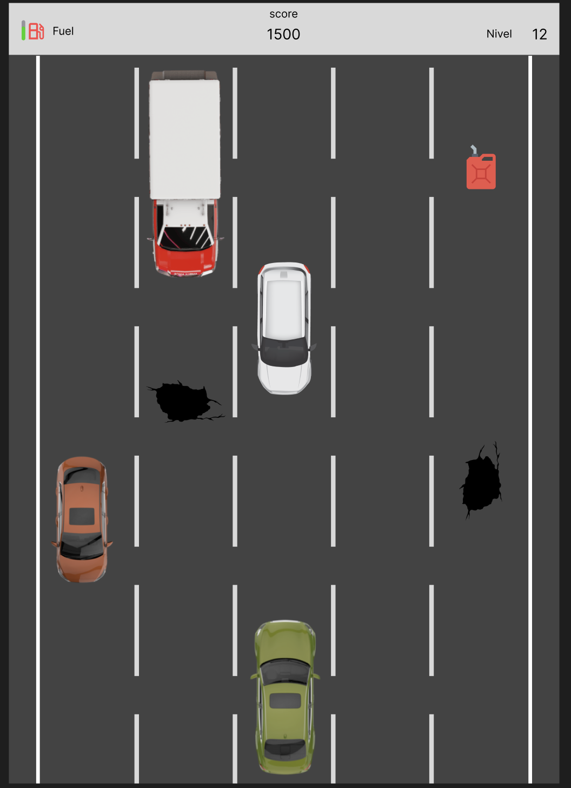

# Mini Go Game (Race Car)

This project is a simple game with the main objective of learning and exploring the Golang language.

## About the Game

The game consists of a car that the player controls on a track with other cars and obstacles such as potholes. 
The objective is to avoid the other vehicles and collect fuel to continue the race. 
The game has a scoring system and difficulty levels (under development). 

## How to Run

1.  Make sure you have Go installed on your machine. You can download it at [https://go.dev/dl/](https://go.dev/dl/).
2.  Clone this repository: `git clone <repository_url>` (Remember to replace `<repository_url>` with the actual URL of your repository)
3.  Navigate to the project directory: `cd mini-game-go`
4.  Run the game: `go run main.go`

See below what the game looks like (image of the game created in Figma): 

## Links
[Changelog](changelog.md) 
[Back](readme.md)
