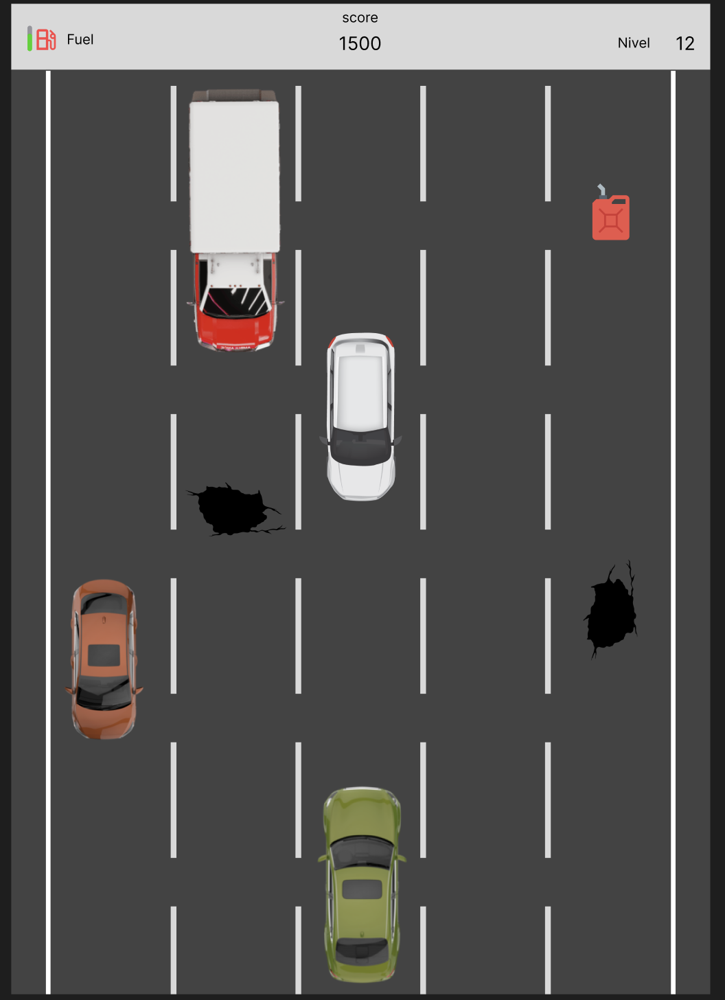

# Mini game go (corrida de carro)

Este projeto é um jogo simples com objetivo principal de aprendizado e exploração da linguagem Golang.

## Sobre o Jogo

O jogo consiste em um carro que o jogador controla em uma pista com outros carros e obistaculos como buracos. 
O objetivo é desviar dos outros veículos e coletar combustível para continuar na corrida. 
O jogo possui um sistema de pontuação e níveis de dificuldade. (emn desenvolvimento) 

Veja abaixo como é o jogo (imagem do jogo criada no Figma): 

## Como Executar
1.  Certifique-se de ter o Go instalado em sua máquina. Você pode baixá-lo em [https://go.dev/dl/](https://go.dev/dl/).
2.  Clone este repositório: `git clone `
3.  Navegue até o diretório do projeto: `cd mini-game-go`
4.  Execute o jogo: `go run main.go`

## Links
[Changelog](changelog.md) 
[Voltar](readme.md)
